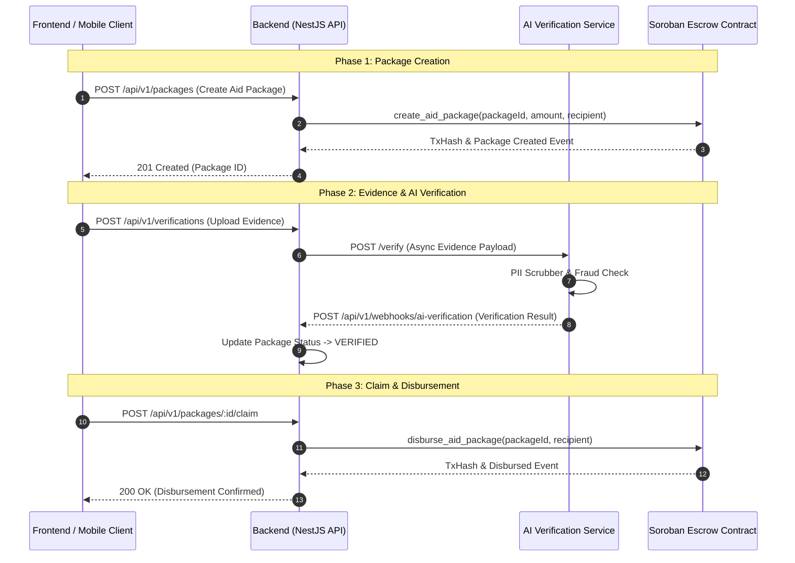

# Cross-Service Architecture Guide: Verification, Evidence, and Onchain Flow

This document details the end-to-end lifecycle of aid package creation, evidence upload, AI verification processing, backend state transitions, and onchain Soroban escrow disbursement across all Soter sub-services.

---

## 1. System Boundary Overview

The Soter platform consists of 4 primary service boundaries:

```
+--------------------------------+       +-----------------------------------+
|  Frontend / Mobile Clients     |       |        Backend (NestJS API)       |
|  - Campaign Management          |<----->|  - Auth & Role-Based Access       |
|  - Evidence Upload (Camera/Web) |       |  - Package State Machine          |
|  - Recipient Claim Interface   |       |  - Audit Log & Event Emitter      |
+--------------------------------+       +-----------------------------------+
                                                           |
                                           +---------------+---------------+
                                           |                               |
                                           v                               v
                        +----------------------+       +-----------------------+
                        |  AI Verification     |       |   Soroban Onchain     |
                        |  Service (Python)    |       |   Escrow Contract     |
                        |  - Visual Evidence   |       |  - Mint Aid Package   |
                        |  - Fraud & PII Filter|       |  - Claim Verification |
                        |  - Verification Score|       |  - Fund Disbursement  |
                        +----------------------+       +-----------------------+
```

---

## 2. Step-by-Step Flow Sequence

### Phase 1: Campaign Creation & Aid Package Issuance
1. **Organization Admin** creates an Aid Campaign via `POST /api/v1/campaigns` on the **Backend**.
2. **Admin / System** issues an Aid Package targeted to a specific recipient address (`POST /api/v1/packages`).
3. **Backend Onchain Adapter** invokes the `aid_escrow` Soroban contract on Stellar Testnet/Mainnet to initialize the onchain package record.

---

### Phase 2: Evidence Submission & AI Processing
4. **Recipient / Field Worker** captures media evidence (photo, receipt, location proof) via **Mobile / Web Frontend**.
5. Evidence binary is stored in S3/Object Storage and submitted to `POST /api/v1/verifications`.
6. **Backend** queues an asynchronous payload to the **AI Verification Service** (`POST /verify`).
7. **AI Verification Service**:
   - Executes PII scrubbing (redacting sensitive facial/identity info).
   - Runs classification & fraud detection models against the evidence.
   - Computes a confidence score (`aiScore` 0.0 – 1.0) and status (`PASSED`, `FLAGGED`, `FAILED`).
8. AI Service fires webhook callback to **Backend** (`POST /api/v1/webhooks/ai-verification`).

---

### Phase 3: Claim & Onchain Disbursement
9. If verification status is `PASSED`, the package transitions to `VERIFIED` state on the **Backend**.
10. Recipient initiates package claim (`POST /api/v1/packages/:id/claim`).
11. **Backend Onchain Adapter** calls `disburse_aid_package` on the **Soroban Smart Contract**, transferring token funds directly to the recipient's Stellar wallet.
12. Smart contract emits `package_disbursed` onchain event, correlated back to the database record via transaction hash.

---

## 3. Sequence Diagram



---

## 4. Mocked vs Production Flows

| Component | Development / Testnet (Mocked) | Production (Intended) |
|-----------|--------------------------------|------------------------|
| **AI Verification** | Deterministic mock scores returning `PASSED` when `metadata.aiScore >= 0.8`. | Multi-modal neural vision model deployed on GPU cluster. |
| **Onchain Escrow** | Stellar Testnet Soroban RPC with Friendbot funded keys. | Stellar Mainnet with multi-sig admin keys & HSM signing. |
| **Evidence Storage** | Local static uploads directory or mock S3 URL. | AWS S3 / IPFS encrypted bucket with signed URLs. |
| **PII Scrubbing** | `scrubber.py` regex-based string filter. | Vision-level blurring & facial anonymization. |
